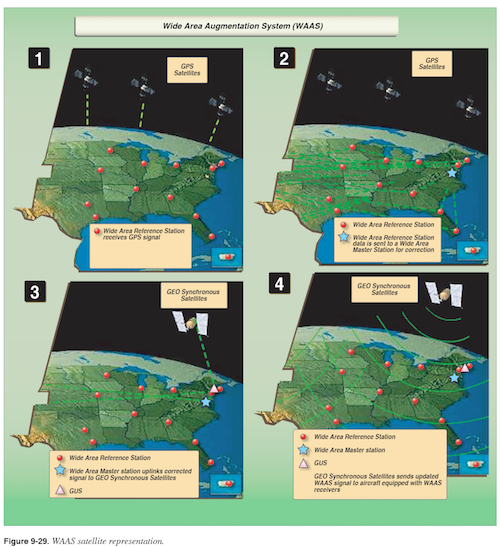

# GPS Navigation

## Objective
To teach the student about the Global Positioning System, and train the student in GPS navigation.

## Elements
- RNAV background
- GPS/GNSS background
- Common GPS functions and benefits
- IFR GPS Requirements
- RAIM
- WAAS
- GPS Approaches
- Using GPS on non-GPS approaches
- GPS pre-flight actions
- GPS gotchas

## Schedule

| Task | ETE |
| ---- | --- |
| Pre-flight Instruction | 1:00 |
| Instructor Demo | 0:10 |
| Student Practice | 1:00 |
| Post-flight Instruction | 0:20 |
| **Total** | **2:30** |

## Equipment
- Aircraft equipped for IFR with GPS
- View-limiting device
- IFR En-Route Low Altitude Charts
- Example GPS Approach Plates
    - LNAV
    - LNAV/VNAV
    - LP
    - LPV
    - RNP

## Instructor Actions

#### Explain RNAV background and capabilities (direct-to/off-route), and legacy VOR/DME RNAV receivers.

#### Explain GNSS (Global Navigation Satellite System) / GPS (Global Positioning System) concepts.
- GPS (USA), Russian GNSS (GLONASS), Galileo (EU)
- Satellite-based, worldwide in scope, operated by Department of Defense, 24 satellites
- In the sky, at least 4 (usually 6-8) satellites in view.
- Receivers are listen-only, triangulating own position, velocity & time.
- Straight-line distances

#### Explain typical benefits and functions of a modern IFR-capable GPS receiver.
- Enhanced Situational Awareness (location, airspace, weather/traffic in advanced displays)
- Name-based waypoint input via navigation databases for fixes, airports, IAPs, STARs, SIDs
- Moving map
- DTK vs Track
- Distance
- ETE & ETA
- Flight-Plan Entry
- Nearest Field, FSS, ATC, VOR
- Auxiliary info: Winds Aloft, Density Altitude computation

#### Explain requirements for a GPS receiver to be usable for IFR navigation:
- Must be installed on the aircraft, hand-held is prohibited and usable for SA only.
- Must meet Technical Standard Order (TSO) C-129 (or equivalent).
- Must be "approved" for IFR operation.
- Must be operated in accordance with POH/AFM or AFM Supplement.
- Current navigation database (expires every **28** days)
- Must have RAIM alerting capability
- Unless GPS is WAAS-equipped, must have non-GPS backup navigation system (VOR/ADF). If IFR alternate is required, alternate must have non-RNAV/GPS approach available (make sure it's not NOTAM'd and check for restrictions like NA at Night).

#### Explain Receiver Autonomous Integrity Monitoring (RAIM).
- Verifies enough GPS satellites in view, detects position error to identify corrupt satellites.
- Required for IFR, many VFR-only GPS receivers not equipped with RAIM alerting capability.
- Need _n+1_ satellites for _n_-dimensional triangulation.
- For RAIM, need _n+2_ to identify bad satellite, or barometric altimeter "baro-aid" to detect integrity anomaly.
- To be able to safely isolate a bad satellite and keep RAIM, need _n+3_ so one can be removed.
- Two ways to lose RAIM: not enough satellites, or potential accuracy error detection.

#### Explain GPS pre-flight requirements:
- File using /G equipment type on FAA flight plan form. ICAO flight plan has other requirements.
- Check GPS NOTAMs, if not WAAS-equipped must do RAIM check (FSS w/ ETA, or on-board).
    - If using GPS SID without WAAS, also request RAIM for departure airport if using FSS.

#### Explain (Wide-Area Augmentation System) WAAS. (IFH 9-32)

- Improves GPS reliability & accuracy
- Measures changes in variables to provide satellite positioning corrections.
    1. Ground stations w/ known positions identify station error, transmit to master ground station.
    2. Master station uplinks corrected signal to GEO Synchronous Satellites.
    3. GEO Synchronous Satellite broadcasts updated WAAS signal to WAAS-equipped GPS receivers on GPS frequency.
- Implementation of ICAO-standardized Satellite-Based Augmentation System.
- Allows use of LP, LPV approaches (see below) - high-precision approaches comparable to Category I LOC/ILS.
- Alleviates requirement that alternate have a non-RNAV/GPS approach.
- WAAS GPS is permitted to be sole navigation source aboard aircraft, no VOR receivers required as backup.
- WAAS GPS receivers will be certified to **TSO-C145A** or **TSO-C146A**. This can be verified in the Flight Manual Supplement.
- Some known WAAS-capable models: Garmin GNS 430**W**/530**W** and G1000. Many others.

#### Explain GPS CDI Sensitivity:
| Location | Sensitivity | RNP |
| -------- | ----------- | --- |
| En-Route | ±5 NM | RNP 2.0 |
| Terminal (within 30 NM) | ±1 NM | RNP 1.0 |
| Approach | ±1 NM to ±0.3 NM at FAF | RNP 0.3 |
| LP/LPV inside FAF | Similar sensitivity/accuracy as LOC/ILS |

#### Explain GPS approaches and demo identifying type of approach
| Type | Full Name | Description |
| ---- | --------- | ----------- |
| LNAV | Lateral Navigation | Non-Precision GPS approach |
| LNAV+V | LNAV with advisory vertical guidance | Same as LNAV, vert guidance advisory only |
| LNAV/VNAV | Lateral Navigation/Vertical Navigation | LNAV with computed vertical guidance, less precise than LPV - higher mins |
| LP | Localizer Performance | Precision approach similar to LOC - requires WAAS |
| LPV | LP with Vertical Guidance | Precision approach similar to ILS - requires WAAS |

Some approach plates mention specific RNP capabilities (i.e. _RNP 0.1_). Commonly seen at large airports near terrain (Albuqurque's [RNAV (RNP) Y RWY 26](http://155.178.201.160/d-tpp/1703/00012RRY26.PDF) is an example). To fly these approaches, GPS must be certified to at least that RNP. Can be confirmed via AFM Supplement.

Baro-aiding (Baro-VNAV) can be used provide vertical guidance on GPS approaches, and allows for 4 GPS satellites instead of 5 to maintain RAIM integrity. When Baro-aided VNAV is in use, temperature restrictions may apply ([KBYG RNAV (GPS) RWY 31](http://155.178.201.160/d-tpp/1703/05705R31.PDF)).

#### Explain GPS use on non-GPS approaches
DME replacement in every capacity, including DME arcs. Valid for lateral navigation up to FAF on any approach (not after), and for entire missed approach segment.

#### Explain T-airways, find using IFR En-Route Low Altitude Charts.

#### Explain common "gotcha" with GPS: Each model can vary greatly (unlike ILS/VOR).
- Ensure familiarity with OBS / SUSP functionality for holds, procedure turns, and missed approaches.
- Good to become familiar with inputting custom waypoints by radial/distance from known waypoint. ATC may issue instructions such as "cleared direct Memphis 215° radial, 20 DME, then as filed." Custom waypoint knowledge is necessary to comply.

## Student Actions
| ✓ | Task |
|---| ---- |
|   | Locate GPS NOTAMs.
|   | Perform a RAIM check, through FSS and with receiver if capable.
|   | Identify GPS navigation database expiration.
|   | Input assigned flight plan into GPS, with SID and STAR if able.
|   | Navigate en-route via flight plan waypoints.
|   | Navigate _direct to_ a waypoint when assigned, using necessary GPS inputs.
|   | Locate _Nearest_ page if applicable.
|   | Identify CDI sensitivity for Terminal, En-Route and Approach segments.
|   | Explore use of vertical navigation (VNAV) features if equipped.
|   | Input a custom waypoint.
|   | Hold at an assigned waypoint, using the OBS/SUSP functions.
|   | Load and arm a GPS approach, including one precision approach with vertical guidance as applicable, and one with a procedure turn. If able, load/arm one using "Vectors to Final" function.
|   | Fly assigned GPS approaches to published minimums. Identify MAP and continue to either landing or missed approach segment as assigned.

## Evaluation
- Exhibits adequate knowledge of the background/regulatory elements related to RNAV & GPS, RAIM, and WAAS.
- Exhibits adequate knowledge of the elements related to navigation via GPS using the airplane's receiver.
- Flies assigned holding pattern within ±1 NM course accuracy, altitude ±100'.
- Flies assigned instrument approaches within 3/4 needle deflection to published minimums. Identifies minimums and executes missed approach, within -20' of DH as applicable. Stops descent at MDA as applicable, +100'/-20'.

## Common Errors
- Failure to interpret varying CDI sensitivity.
- Chasing CDI needles.
- Inability to manage GPS "load/arm approach", "hold" functions.
- Forgetting to resume GPS sequencing after reaching MAP.

## References
[Pilot's Handbook of Aeronautical Knowledge Chapter 16 p.35](https://www.faa.gov/regulations_policies/handbooks_manuals/aviation/phak/media/18_phak_ch16.pdf)

[Instrument Flying Handbook Chapter 9 p.22-33, 44](https://www.faa.gov/regulations_policies/handbooks_manuals/aviation/media/FAA-H-8083-15B.pdf)

FAR/AIM

[FAA RNAV (GPS) Approaches Fact Sheet](https://www.faa.gov/about/office_org/headquarters_offices/ato/service_units/techops/navservices/gnss/library/factsheets/media/RNAV_QFacts_final_06122012.pdf)

[FAA RNP Approaches Fact Sheet](https://www.faa.gov/about/office_org/headquarters_offices/ato/service_units/techops/navservices/gnss/library/factsheets/media/RNAV_QFSheet.pdf)